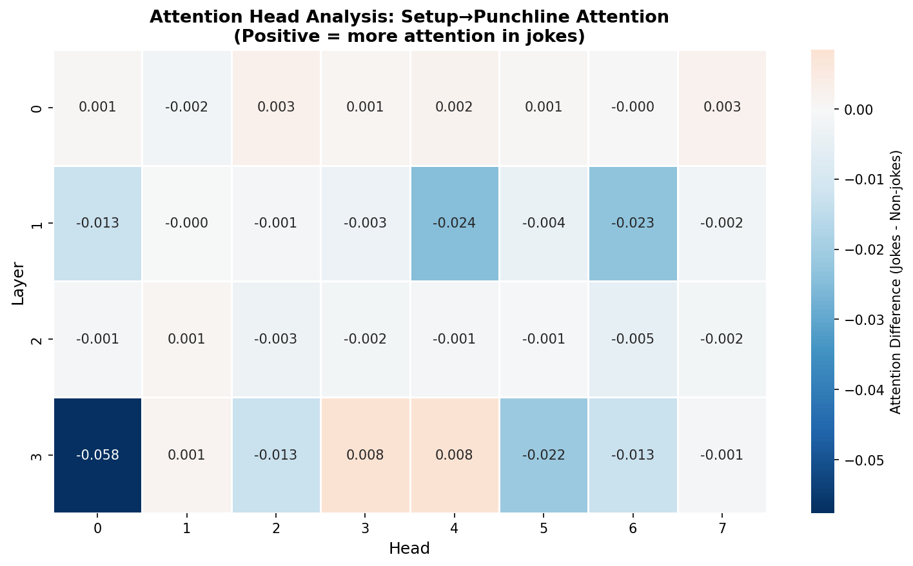

# Mechanistic Interpretability of Humor Understanding

> Training transformers to understand jokes and finding the circuits that make them laugh.

## Overview

This project investigates how transformers learn to understand humor through mechanistic interpretability. We trained a 64M parameter model from scratch on 22k jokes and analyzed the internal circuits that distinguish jokes from normal text.

**Key Finding:** The model learns distributed semantic representations for humor rather than simple attention patterns. Non-jokes use explicit setup→punchline attention for coherence, while jokes rely on distributed processing to capture semantic surprise.

## Quick Results

### The Model Actually Learned Jokes

```
Setup: Why did the scarecrow win an award?
Generated: Because he was outstanding in his field

Setup: What do you call a bear with no teeth?
Generated: A gummy bear

Setup: Why don't scientists trust atoms?
Generated: They make up everything
```

### Circuit Structure


- **All layers** achieve perfect joke/non-joke separation (1.0 accuracy)
- **Distributed representation** - no single bottleneck layer
- **Jokes cluster distinctly** in activation space (see PCA visualization)

### Attention Patterns



**Surprising discovery:** Non-jokes use MORE setup→punchline attention than jokes (-0.058 difference in Layer 3, Head 0). This suggests:
- Non-jokes track explicit coherence through attention
- Jokes use distributed semantic mechanisms beyond simple attention copying

## Model Specs

- **Architecture:** Custom HookedTransformer (via TransformerLens)
- **Size:** 64.2M parameters
- **Layers:** 4 transformer layers
- **Attention Heads:** 8 per layer
- **Training:** 30 epochs (~34k steps) on 22k examples
- **Final Loss:** 0.33
- **Training Time:** ~2 hours on T4 GPU

## Repository Structure

```
notebooks/     - Jupyter notebooks for each analysis phase
results/       - Generated visualizations and analysis outputs
examples/      - Generated joke examples
docs/          - Detailed methodology and findings
```

## Getting Started

### Installation

```bash
pip install -r requirements.txt
```

### Quick Start

1. **Data Preparation:** Run `notebooks/01_data_preparation.ipynb`
2. **Training:** Run `notebooks/02_training.ipynb` (takes ~2 hours)
3. **Analysis:** Run `notebooks/03_circuit_analysis.ipynb` and `04_attention_heads.ipynb`

Or use `notebooks/05_full_pipeline.ipynb` for the complete end-to-end workflow.

See [REPRODUCTION.md](docs/REPRODUCTION.md) for detailed instructions.

## Key Findings

### 1. Model Learning
- Converged to 0.33 loss in 2 hours
- Generates coherent, contextually appropriate punchlines
- Perfect internal separation of jokes vs non-jokes across all layers

### 2. Circuit Structure
- Humor understanding is **distributed** across all layers
- No single "joke neuron" or bottleneck layer
- All layers contribute to joke detection with 1.0 probe accuracy

### 3. Attention Strategy Differences
- **Non-jokes:** Use explicit setup→punchline attention (tracking coherence)
- **Jokes:** Use distributed semantic processing (capturing incongruity)
- Layer 3, Head 0 shows strongest difference (-0.058)

### 4. Representation Space
- Jokes form tight clusters in activation space
- Non-jokes show more diversity (makes sense - "normal" is broader)
- Clear linear separability at all layers

See [FINDINGS.md](docs/FINDINGS.md) for detailed analysis.

## Methodology

We followed a three-phase mechanistic interpretability approach:

**Phase 1: Training with Probe Tracking**
- Train transformer on joke completion task
- Track linear probe accuracy at each layer every 500 steps
- Monitor for grokking-style circuit emergence

**Phase 2: Circuit Discovery**
- Extract activations at setup/punchline positions
- Train probes to identify important neurons
- Analyze attention patterns across all heads
- Identify heads with differential joke/non-joke attention

**Phase 3: Interpretation**
- PCA visualization of activation spaces
- Comparison of attention strategies
- Analysis of distributed vs localized processing

See [METHODOLOGY.md](docs/METHODOLOGY.md) for details.

## Citation

If you use this work, please cite:

```bibtex
@misc{joke-circuits-2026,
  author = {Wordson Robert},
  title = {Mechanistic Interpretability of Humor Understanding},
  year = {2026},
  url = {https://github.com/[your-username]/joke-circuits}
}
```

## Acknowledgments

Built with [TransformerLens](https://github.com/TransformerLensOrg/TransformerLens) by Neel Nanda.

Inspired by mechanistic interpretability work from:
- [Anthropic's Transformer Circuits Thread](https://transformer-circuits.pub/)
- [Neel Nanda's MI tutorials](https://github.com/neelnanda-io/TransformerLens)

Joke dataset from [taivop/joke-dataset](https://github.com/taivop/joke-dataset).

## License

MIT License - See LICENSE file for details.

---

*Turns out transformers have a sense of humor. Who knew?* 🎭
